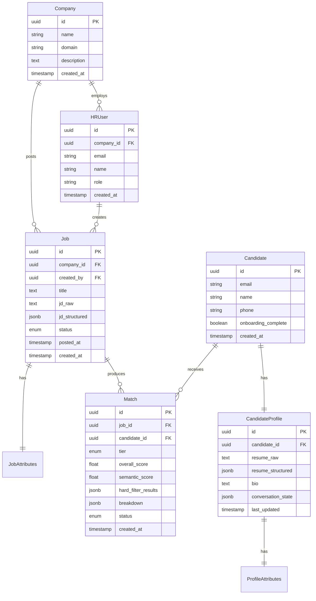

# Data Model

## Entity Relationship



## Shared Attribute Ontology

This is the critical piece. Both JD extraction and profile extraction must map to the **same schema** so matching works.

### JobAttributes (extracted from JD)

```json
{
  "role_title": "Senior Backend Engineer",
  "seniority": "senior",
  "experience_range": { "min": 3, "max": 5, "unit": "years" },
  "skills_required": [
    { "name": "Python", "category": "language", "importance": "required" },
    { "name": "distributed systems", "category": "domain", "importance": "required" },
    { "name": "Go", "category": "language", "importance": "nice_to_have" }
  ],
  "ctc_range": { "min": 2000000, "max": 3000000, "currency": "INR" },
  "location": {
    "cities": ["Bangalore", "Mumbai"],
    "remote_policy": "hybrid"
  },
  "education": {
    "min_degree": "bachelors",
    "preferred_fields": ["CS", "IT"]
  },
  "embedding": [0.012, -0.034, ...]  // Generated from full JD text
}
```

### ProfileAttributes (extracted from candidate)

```json
{
  "current_role": "Backend Engineer",
  "seniority": "mid",
  "total_experience": { "value": 2.5, "unit": "years" },
  "skills": [
    { "name": "Python", "category": "language", "proficiency": "advanced" },
    { "name": "distributed systems", "category": "domain", "proficiency": "intermediate" },
    { "name": "Kubernetes", "category": "infra", "proficiency": "intermediate" }
  ],
  "current_ctc": { "value": 1500000, "currency": "INR" },
  "expected_ctc": { "min": 2000000, "max": 2500000, "currency": "INR" },
  "location": {
    "current_city": "Bangalore",
    "open_to": ["Bangalore", "Remote"],
    "remote_preference": "remote_preferred"
  },
  "education": {
    "degree": "bachelors",
    "field": "Computer Science",
    "institution": "XYZ University"
  },
  "notice_period_days": 30,
  "embedding": [0.008, -0.041, ...]  // Generated from full profile text
}
```

### Skill Taxonomy

Skills are normalized to a shared taxonomy to prevent matching failures from naming differences.

```
"ReactJS" → "React"
"Golang"  → "Go"
"AWS EC2" → category: "cloud/aws", specific: "EC2"
"ML"      → "Machine Learning"
```

Approach: Maintain a skills normalization table. When extracting from JD or profile, normalize against it. Use LLM for fuzzy matching on new/unknown skills, then add to the table.

### Match Tiers

| Tier | Logic |
|---|---|
| **Strong** | All hard filters pass AND semantic score > 0.8 |
| **Semantic** | Semantic score > 0.7, some hard filters may miss |
| **Stretch** | Semantic score > 0.75, hard filters miss by small margin (experience ±1yr, CTC ±20%) |

### Hard Filters
- Experience within range
- CTC expectation overlaps with offered range
- Location / remote policy compatible
- Required skills present (≥70% match)

### Semantic Matching
- Embed full JD text and full profile text
- Cosine similarity on pgvector
- Captures nuance that hard filters miss (domain experience, project relevance, etc.)

## Enums

```
JobStatus: draft | active | paused | closed | filled
MatchTier: strong | semantic | stretch
MatchStatus: new | shortlisted | rejected | contacted
Seniority: intern | junior | mid | senior | lead | principal
RemotePolicy: onsite | hybrid | remote | remote_preferred
SkillImportance: required | nice_to_have
```
