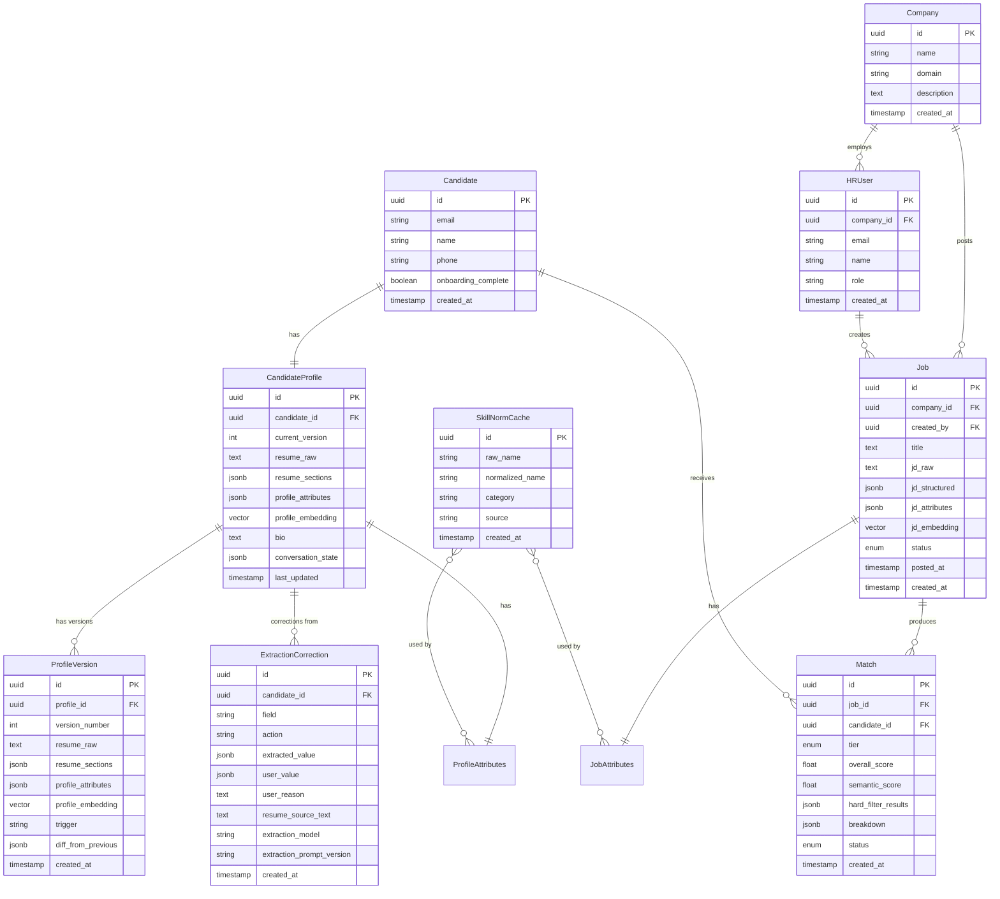

# Data Model

## Entity Relationship



## Extraction Philosophy

> **Extract maximally, normalize best-effort, store both. All heavy lifting happens in the background.**

Every piece of data goes through this pipeline:

```
Raw text (JD / resume / chat)
    ↓
LLM Extraction — pull out everything possible
    ↓
Store raw extraction (nothing lost, reprocessable later)
    ↓
Best-effort normalization (LLM-assisted, cached)
    ↓
Store normalized version alongside raw
    ↓
Generate embeddings from full raw text
    ↓
Matching uses:
  - Normalized fields → hard filters (experience, CTC, skill names)
  - Embeddings → semantic matching (education fit, domain depth, nuance)
```

**All extraction, normalization, embedding generation, and matching runs as background jobs.** The user (HR or candidate) never waits for these. UX stays snappy — processing happens async.

**Why both raw + normalized?** Raw gives you flexibility to re-extract or re-normalize later as your system improves. Normalized gives you queryable, filterable data today. Neither alone is enough.

**Why extract maximally?** You don't know what you'll need later. A JD mentions "Series B startup, 50-person engineering team" — that's not a filter today, but it might be a matching signal tomorrow. Extract it, store it, figure out how to use it later.

---

## Profile Versioning

Candidate profiles evolve. Resumes get updated, skills change, CTC expectations shift. We version everything.

**When a new version is created:**
- Candidate uploads a new resume
- Candidate explicitly says "update my profile" in chat
- Candidate returns after extended inactivity (>60 days) and we prompt: "Anything changed since last time?"

**What happens:**
1. Current profile is snapshotted as a `ProfileVersion`
2. New extraction runs on the updated data (background job)
3. `diff_from_previous` captures what changed (for the candidate to review + for analytics)
4. `CandidateProfile` always reflects the **latest version**
5. Old versions are kept for history — never deleted

**What triggers re-matching:**
- Any version update triggers a background re-match against all active jobs
- Old match scores are archived, new ones computed
- Candidate sees updated matches on their dashboard next time they visit

```
Candidate uploads new resume
    ↓
Snapshot current profile → ProfileVersion (background)
    ↓
Re-extract from new resume (background)
    ↓
Conversational gap-fill if needed (only for new info)
    ↓
Update CandidateProfile (background)
    ↓
Re-generate embedding (background)
    ↓
Re-compute matches (background)
    ↓
Candidate sees updated profile + matches on next visit
```

---

## Shared Attribute Ontology

Both JD extraction and profile extraction map to the **same schema structure** so matching works. The key: attributes that are naturally numeric/categorical get normalized; attributes that are nuanced get stored as structured text + semantic embeddings.

### JobAttributes (extracted from JD)

```json
{
  "role_title": "Senior Backend Engineer",
  "seniority": "senior",
  "department": "Engineering",
  "experience_range": { "min": 3, "max": 5, "unit": "years" },

  "skills": [
    {
      "raw": "ReactJS",
      "normalized": "React",
      "category": "frontend/library",
      "importance": "required"
    },
    {
      "raw": "distributed systems",
      "normalized": "Distributed Systems",
      "category": "domain",
      "importance": "required"
    },
    {
      "raw": "Golang or Python",
      "normalized": ["Go", "Python"],
      "category": "language",
      "importance": "required",
      "note": "either one accepted"
    }
  ],

  "ctc_range": { "min": 2000000, "max": 3000000, "currency": "INR" },

  "location": {
    "cities": ["Bangalore", "Mumbai"],
    "remote_policy": "hybrid",
    "relocation_support": true
  },

  "education": {
    "raw": "Masters in CS or equivalent experience, MBA preferred for leadership track",
    "parsed": {
      "degrees": ["masters", "mba"],
      "fields": ["CS", "IT", "Software Engineering"],
      "equivalence": "experience_accepted",
      "strictness": "preferred"
    }
  },

  "extras": {
    "company_stage": "Series B",
    "team_size": "50 engineers",
    "benefits_mentioned": ["ESOP", "health insurance", "learning budget"],
    "visa_sponsorship": false,
    "travel_required": "occasional"
  },

  "embedding": [0.012, -0.034, ...]
}
```

### ProfileAttributes (extracted from candidate)

```json
{
  "current_role": "Backend Engineer",
  "seniority": "mid",
  "total_experience": { "value": 2.5, "unit": "years" },

  "work_history": [
    {
      "company": "Startup X",
      "role": "Backend Engineer",
      "duration": { "value": 1.5, "unit": "years" },
      "raw_description": "Built payment microservices handling 10k TPS",
      "skills_used": ["Python", "Kafka", "PostgreSQL"]
    }
  ],

  "skills": [
    {
      "raw": "Python",
      "normalized": "Python",
      "category": "language",
      "proficiency": "advanced",
      "years_used": 2.5,
      "context": "primary language at current and previous roles"
    },
    {
      "raw": "K8s",
      "normalized": "Kubernetes",
      "category": "infra/orchestration",
      "proficiency": "intermediate",
      "years_used": 1,
      "context": "managed production clusters"
    }
  ],

  "current_ctc": { "value": 1500000, "currency": "INR", "includes_esop": false },
  "expected_ctc": { "min": 2000000, "max": 2500000, "currency": "INR" },

  "location": {
    "current_city": "Bangalore",
    "open_to": ["Bangalore", "Remote"],
    "remote_preference": "remote_preferred",
    "willing_to_relocate": false
  },

  "education": {
    "raw": "B.Tech in Computer Science from XYZ University, 2021",
    "parsed": {
      "degree": "bachelors",
      "field": "Computer Science",
      "institution": "XYZ University",
      "year": 2021
    }
  },

  "notice_period": {
    "days": 30,
    "negotiable": true,
    "note": "Can negotiate to 15 days for the right role"
  },

  "job_switch": {
    "reason": "Looking for more ownership and technical challenges",
    "urgency": "active",
    "actively_interviewing": true,
    "offers_in_hand": 0
  },

  "preferences": {
    "looking_for": "Senior role at a product company working on distributed systems",
    "dealbreakers": ["No onsite-only roles", "No service/consulting companies"],
    "preferred_company_stage": ["startup", "growth"],
    "preferred_team_size": "small"
  },

  "extras": {
    "languages_spoken": ["English", "Hindi"],
    "certifications": ["AWS Solutions Architect Associate"],
    "open_source_contributions": "contributor to FastAPI",
    "portfolio_url": "https://example.com"
  },

  "embedding": [0.008, -0.041, ...]
}
```

### `resume_sections` (formerly `resume_structured`)

The parsed sections of the resume PDF/DOCX, preserved in their original structure. Used for displaying back to the candidate in a readable format and for re-extraction.

```json
{
  "sections": [
    {
      "heading": "Experience",
      "content": "Backend Engineer at Startup X (2022-present)\n- Built payment microservices...",
      "order": 1
    },
    {
      "heading": "Education",
      "content": "B.Tech in Computer Science, XYZ University, 2021",
      "order": 2
    },
    {
      "heading": "Skills",
      "content": "Python, Kubernetes, PostgreSQL, Kafka, Redis",
      "order": 3
    },
    {
      "heading": "Projects",
      "content": "Open source contributor to FastAPI...",
      "order": 4
    }
  ],
  "raw_text": "Full extracted text from PDF...",
  "file_hash": "sha256:abc123...",
  "parsed_at": "2026-04-01T12:00:00Z"
}
```

`file_hash` lets us detect if a "new" resume upload is actually the same file — skip re-extraction if it hasn't changed.

---

## Extraction Corrections (Prompt Improvement Harness)

Every time a candidate corrects an AI-extracted field, we log it. This isn't used in real-time — it's a training signal for improving extraction prompts.

```sql
CREATE TABLE extraction_correction (
    id UUID PRIMARY KEY,
    candidate_id UUID NOT NULL REFERENCES candidate(id),
    field TEXT NOT NULL,                    -- "total_experience", "skills", "current_role"
    action TEXT NOT NULL,                   -- "modified", "added", "removed"
    extracted_value JSONB,                  -- What AI extracted
    user_value JSONB,                       -- What candidate corrected it to
    user_reason TEXT,                       -- Why ("including freelance", "not listed on resume")
    resume_source_text TEXT,               -- The part of resume AI based extraction on
    extraction_model TEXT,                  -- Which LLM model ran extraction
    extraction_prompt_version TEXT,         -- Which prompt version was used
    created_at TIMESTAMP
);

CREATE INDEX idx_correction_field ON extraction_correction(field);
CREATE INDEX idx_correction_prompt ON extraction_correction(extraction_prompt_version);
```

**How to use this data:**
1. Query by field: `SELECT * FROM extraction_correction WHERE field = 'total_experience'` → see all experience-related corrections
2. Spot patterns: If 30% of experience corrections mention "freelance" → update extraction prompt to account for freelance work
3. Track improvement: After updating prompts, correction rate for that field should drop
4. Track per model/prompt version: Know exactly which prompt version caused which errors

**What gets stored in the profile:** Always the **user's corrected value**. The AI extraction is only in the correction log. The candidate's word is truth.

---

## Skill Normalization Cache

NOT a master taxonomy. A growing cache of mappings we've seen, built organically.

```sql
CREATE TABLE skill_norm_cache (
    id UUID PRIMARY KEY,
    raw_name TEXT NOT NULL,          -- What was written: "ReactJS", "react.js", "React JS"
    normalized_name TEXT NOT NULL,   -- What we normalize to: "React"
    category TEXT,                   -- "frontend/library", "language", "domain", "infra"
    source TEXT,                     -- "jd_extraction", "profile_extraction", "manual"
    created_at TIMESTAMP
);

-- Index for lookup during extraction
CREATE UNIQUE INDEX idx_skill_raw ON skill_norm_cache(LOWER(raw_name));
```

**How it works:**
1. LLM extracts skill from text → "ReactJS"
2. Check cache: `SELECT normalized_name FROM skill_norm_cache WHERE LOWER(raw_name) = 'reactjs'`
3. Cache hit → use normalized name
4. Cache miss → LLM normalizes ("ReactJS" → "React") → insert into cache → use it
5. Cache grows over time, LLM calls decrease

**Why not a static taxonomy?**
- New tools/frameworks appear constantly
- Domain-specific skills are infinite (bioinformatics, quant finance, etc.)
- A static list needs a human curator. Nobody does that job.
- LLM-assisted normalization handles the long tail gracefully

---

## What gets hard-filtered vs. semantic-matched

| Attribute | Hard Filter? | Semantic? | Why |
|---|---|---|---|
| Experience (years) | Yes | No | Numeric, clear range |
| CTC | Yes | No | Numeric, clear range |
| Location + remote | Yes | No | Categorical, clear match |
| Required skills (normalized) | Yes (≥70%) | Also yes | Names for precision, embeddings for depth |
| Education | No | Yes | Too nuanced for hard filters. "Masters or equivalent" can't be a boolean. |
| Seniority | Soft filter | Yes | Titles vary wildly across companies |
| Nice-to-have skills | No | Yes | Bonus signal, not gatekeeping |
| Notice period | Soft filter | No | Negotiable periods need human judgment |
| Preferences / dealbreakers | Candidate-side filter | No | Candidate opts out, not filtered out |
| Extras (stage, team size) | No | Yes (future) | Enrichment signal, not filter |

### Match Tiers

| Tier | Logic |
|---|---|
| **Strong** | All hard filters pass AND semantic score > 0.8 |
| **Semantic** | Semantic score > 0.7, some hard filters may miss |
| **Stretch** | Semantic score > 0.75, hard filters miss by small margin (experience ±1yr, CTC ±20%) |

---

## Enums

```
JobStatus: draft | active | paused | closed | filled
MatchTier: strong | semantic | stretch
MatchStatus: new | shortlisted | rejected | contacted
Seniority: intern | junior | mid | senior | lead | principal
RemotePolicy: onsite | hybrid | remote | remote_preferred
SkillImportance: required | nice_to_have
SkillProficiency: beginner | intermediate | advanced | expert
EducationStrictness: required | preferred | not_mentioned
EducationEquivalence: strict | experience_accepted | not_specified
NoticePeriod: immediate | 15_days | 30_days | 60_days | 90_days | negotiable | serving
JobSwitchUrgency: active | open_to_offers | not_looking | urgent
ProfileVersionTrigger: initial_onboarding | resume_upload | chat_update | inactivity_refresh
```
