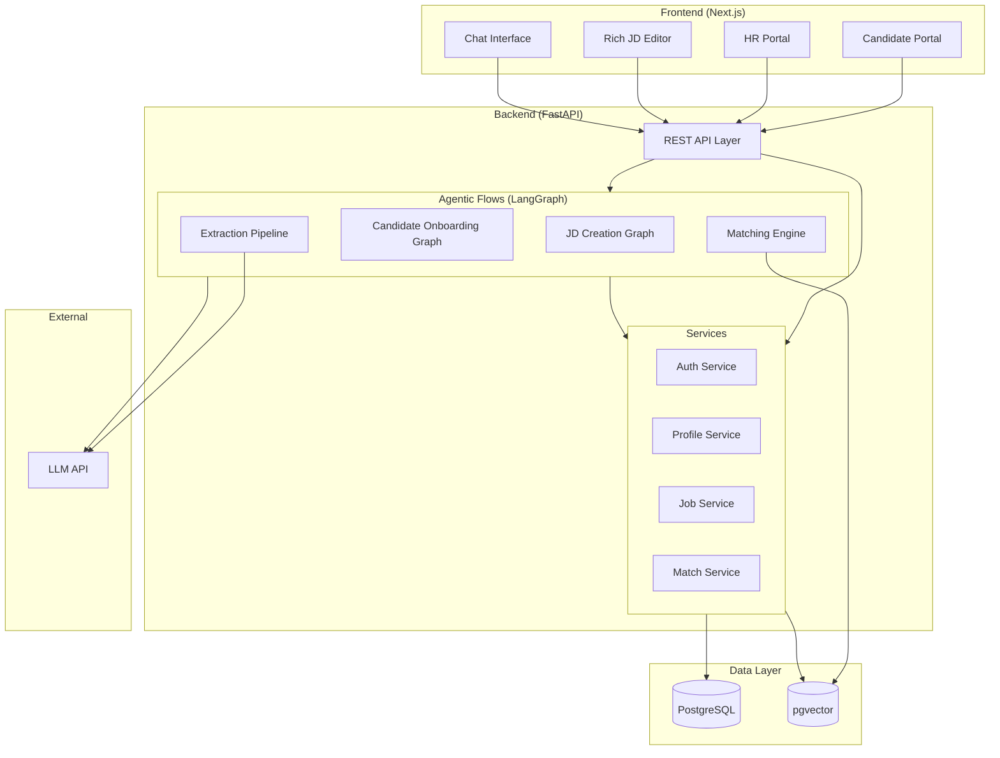

# High-Level Design

## System Overview

## Component Breakdown

### Frontend
| Component | Purpose |
|---|---|
| Chat Interface | Shared component. Used in JD creation (HR) and onboarding (candidate). WebSocket connection for streaming AI responses. |
| Rich Editor | Notion-like block editor for JD editing. Output is structured content that feeds into extraction. |
| Candidate Portal | Dashboard, profile view, job listings, match visibility |
| HR Portal | Dashboard, job management, candidate pipeline, analytics |

### Backend — API Layer
Standard REST API. Handles auth, CRUD, and orchestrates graph invocations.

No business logic in API routes — they delegate to services or invoke graphs.

### Backend — Agentic Flows (LangGraph)

Each flow is a self-contained graph with defined inputs/outputs (see CONTRACTS.md).

| Graph | Trigger | Purpose |
|---|---|---|
| JD Creation | HR starts new opening | Conversational JD generation from requirements |
| JD Extraction | HR finalizes JD | Extracts structured attributes from final JD text |
| Candidate Onboarding | Candidate signs up | Resume extraction → conversational gap-filling → profile |
| Profile Extraction | Onboarding completes | Normalizes profile into matchable attributes |
| Matching | Job posted or profile updated | Computes hard + semantic + stretch matches |

### Backend — Services
Thin layer between API/graphs and database. Handles persistence, validation, business rules.

### Data Layer
- **PostgreSQL**: All structured data — users, companies, jobs, profiles, matches
- **pgvector**: Embeddings for semantic matching. Stored alongside structured data in same DB.

## Key Decisions

| Decision | Choice | Why |
|---|---|---|
| Single DB (Postgres + pgvector) | Over separate vector DB (Pinecone, Weaviate) | Simpler ops, transactional consistency between structured data and embeddings. pgvector is good enough for our scale. Revisit if we hit millions of profiles. |
| LangGraph for agentic flows | Over raw LLM calls or LangChain agents | We need stateful, multi-step, persistent flows with human-in-the-loop. LangGraph's graph model maps perfectly. Checkpointing gives us persistence for free. |
| FastAPI | Over Django, Express | Async-native, great for streaming LLM responses, Python ecosystem for ML/AI. Team knows it. |
| Next.js App Router | Over Vite/React SPA | SSR for public job pages (SEO), API routes for BFF pattern, good DX. |
| REST over GraphQL | For now | Simpler. We don't have complex nested queries yet. Can add GraphQL later if frontend data needs get gnarly. |
| Monorepo | Over separate repos | Single project, small team. Deploy together, version together. Split when/if team grows. |

## What's NOT in this design (yet)
- Real-time notifications (WebSocket push for "company interested in you")
- File storage service (resume PDFs — will need S3 or similar)
- Background job processing (matching recomputation — may need Celery/ARQ)
- Rate limiting, caching, CDN
